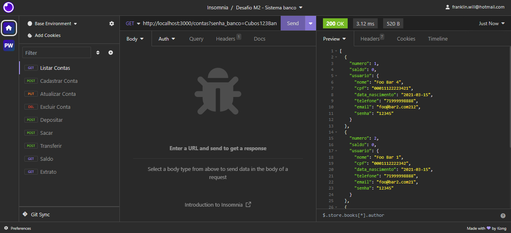
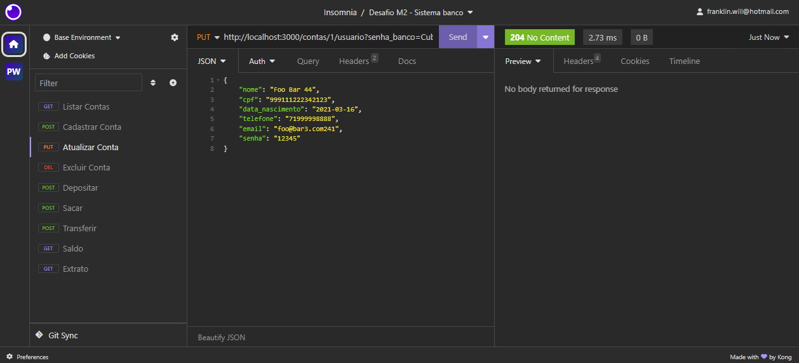
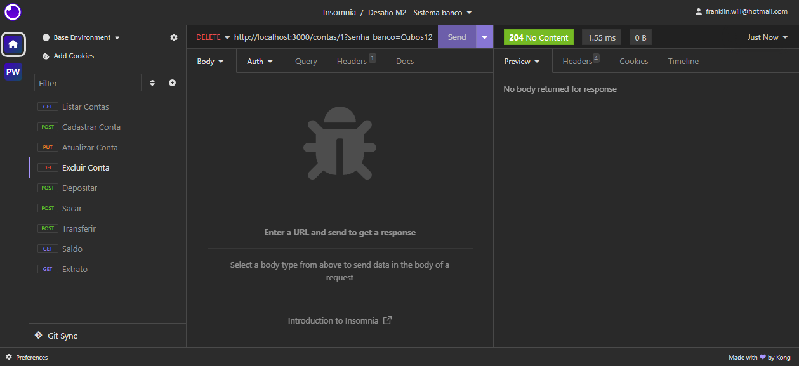
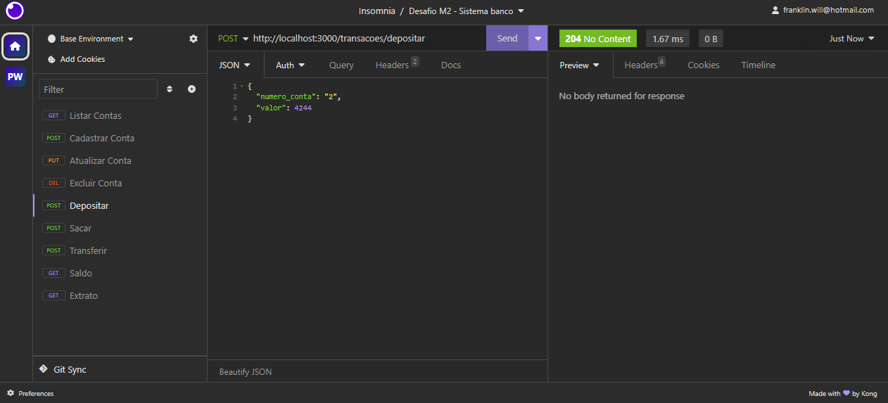
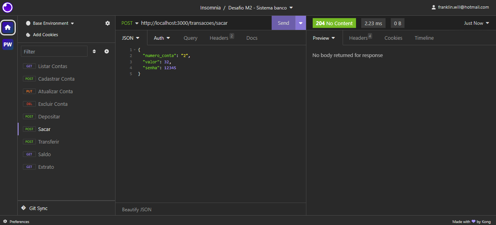
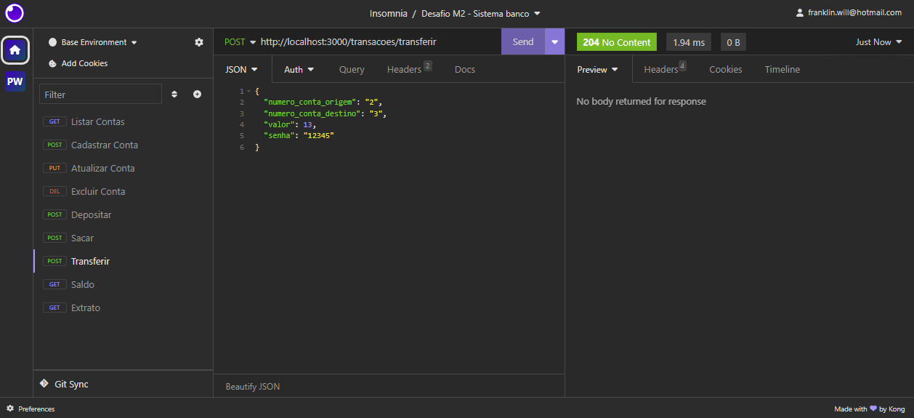
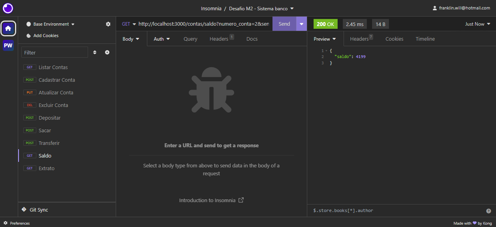
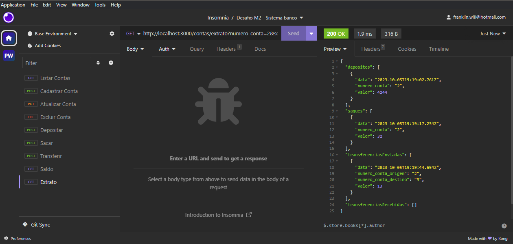

# sistema-banco
Back-end de um sistema de um banco, feito em JavaScript, Node.js. Usando API REST e JSON.

Acessar os recursos do programa através de um servidor local com porta 3000 (http://localhost:3000)

ROTAS:

GET /contas?senha_banco=Cubos123Bank : Lista todas as contas cadastradas (Banco de dados inicia zerado) (Senha do admin do banco requerida na quarry)

POST /contas : Cadastra uma nova conta (precisa da validação da senha_banco na quarry)

PUT /contas/:numeroConta/usuario : Atualiza uma conta existente

DELETE /contas/:numeroConta : Exclui uma conta existente

POST /transacoes/depositar : Realiza a operação de deposito em uma conta existente

POST /transacoes/sacar : Saque em uma conta existente (Senha requerida no body da requisição, no formato JSON)

POST /transacoes/transferir : Tranferência entre contas existentes (Senha requerida no body da requisição, no formato JSON)

GET /contas/saldo?numero_conta=123&senha=123 : Exibir o saldo de uma conta existente (Senha requerida na quarry)

GET /contas/extrato?numero_conta=123&senha=123 : Exibir o extrato (Histórico de transações: saque, saque e transferencias) de uma conta existente (Senha requerida na quarry)
